# Дипломный практикум в Yandex.Cloud

@Martyanov Andrey

## Этап 1:

<details>
    <summary><h2>Создание облачной инфраструктуры</h1></summary>
Для начала необходимо подготовить облачную инфраструктуру в ЯО при помощи [Terraform](https://www.terraform.io/).

Особенности выполнения:

- Бюджет купона ограничен, что следует иметь в виду при проектировании инфраструктуры и использовании ресурсов;
- Следует использовать последнюю стабильную версию [Terraform](https://www.terraform.io/).

Предварительная подготовка к установке и запуску Kubernetes кластера.

1. Создайте сервисный аккаунт, который будет в дальнейшем использоваться Terraform для работы с инфраструктурой с необходимыми и достаточными правами. Не стоит использовать права суперпользователя
2. Подготовьте [backend](https://www.terraform.io/docs/language/settings/backends/index.html) для Terraform:  
   а. Рекомендуемый вариант: [Terraform Cloud](https://app.terraform.io/)  
   б. Альтернативный вариант: S3 bucket в созданном ЯО аккаунте
3. Настройте [workspaces](https://www.terraform.io/docs/language/state/workspaces.html)  
   а. Рекомендуемый вариант: создайте два workspace: *stage* и *prod*. В случае выбора этого варианта все последующие шаги должны учитывать факт существования нескольких workspace.  
   б. Альтернативный вариант: используйте один workspace, назвав его *stage*. Пожалуйста, не используйте workspace, создаваемый Terraform-ом по-умолчанию (*default*).
4. Создайте VPC с подсетями в разных зонах доступности.
5. Убедитесь, что теперь вы можете выполнить команды `terraform destroy` и `terraform apply` без дополнительных ручных действий.
6. В случае использования [Terraform Cloud](https://app.terraform.io/) в качестве [backend](https://www.terraform.io/docs/language/settings/backends/index.html) убедитесь, что применение изменений успешно проходит, используя web-интерфейс Terraform cloud.

Ожидаемые результаты:

1. Terraform сконфигурирован и создание инфраструктуры посредством Terraform возможно без дополнительных ручных действий.
2. Полученная конфигурация инфраструктуры является предварительной, поэтому в ходе дальнейшего выполнения задания возможны изменения.

---

## Ответ:

Я создал учетку в terraform cloud:


И приступил к созданию структуры terraform:
так как нас интересует 2 workspace, создал 2 каталога: stage и prod
в каждом каталоге описан файл backend.tf в котором указана организация и проект, к котором он относится в terraform cloud

Описал создание VPC <br>
[task1](./task/terraform/task1/) <br>

Далее необходимо залогиниться в teraform cloud и сделать api key:
```
terraform login
```
После этого необходимо выполнить команду:
```
terraform init
```


Apply проходит успешно и в облаке создается 3 сеть и 3 виртуалки


Так же при желании можно этот процесс запустить из terraform cloud:


</details><br>

## Этап 2:

<details>
    <summary><h2>Создание Kubernetes кластера</h1></summary>

На этом этапе необходимо создать [Kubernetes](https://kubernetes.io/ru/docs/concepts/overview/what-is-kubernetes/) кластер на базе предварительно созданной инфраструктуры.   Требуется обеспечить доступ к ресурсам из Интернета.

Это можно сделать двумя способами:

1. Рекомендуемый вариант: самостоятельная установка Kubernetes кластера.  
   а. При помощи Terraform подготовить как минимум 3 виртуальных машины Compute Cloud для создания Kubernetes-кластера. Тип виртуальной машины следует выбрать самостоятельно с учётом требовании к производительности и стоимости. Если в дальнейшем поймете, что необходимо сменить тип инстанса, используйте Terraform для внесения изменений.  
   б. Подготовить [ansible](https://www.ansible.com/) конфигурации, можно воспользоваться, например [Kubespray](https://kubernetes.io/docs/setup/production-environment/tools/kubespray/)  
   в. Задеплои$$ть Kubernetes на подготовленные ранее инстансы, в случае нехватки каких-либо ресурсов вы всегда можете создать их при помощи Terraform.
2. Альтернативный вариант: воспользуйтесь сервисом [Yandex Managed Service for Kubernetes](https://cloud.yandex.ru/services/managed-kubernetes)  
  а. С помощью terraform resource для [kubernetes](https://registry.terraform.io/providers/yandex-cloud/yandex/latest/docs/resources/kubernetes_cluster) создать региональный мастер kubernetes с размещением нод в разных 3 подсетях      
  б. С помощью terraform resource для [kubernetes node group](https://registry.terraform.io/providers/yandex-cloud/yandex/latest/docs/resources/kubernetes_node_group)
  
Ожидаемый результат:

1. Работоспособный Kubernetes кластер.
2. В файле `~/.kube/config` находятся данные для доступа к кластеру.
3. Команда `kubectl get pods --all-namespaces` отрабатывает без ошибок.

---

## Ответ:

На этом этапе я решил отбросить способ создания кластера через kuberspray, т.к в моем случае каждое создание кластера занимает по часу-полтора и я чеcтно говоря пригорел :) <br>
Поэтому переписал terraform на создание managed k8s в YC и создавал за минут 15 <br>
[k8s prod](./task/terraform/k8s_prod/) <br>
[k8s stage](./task/terraform/k8s_stage/) <br>

Кластеры в своих каталогах создаются без проблем: <br>
prod: <br>
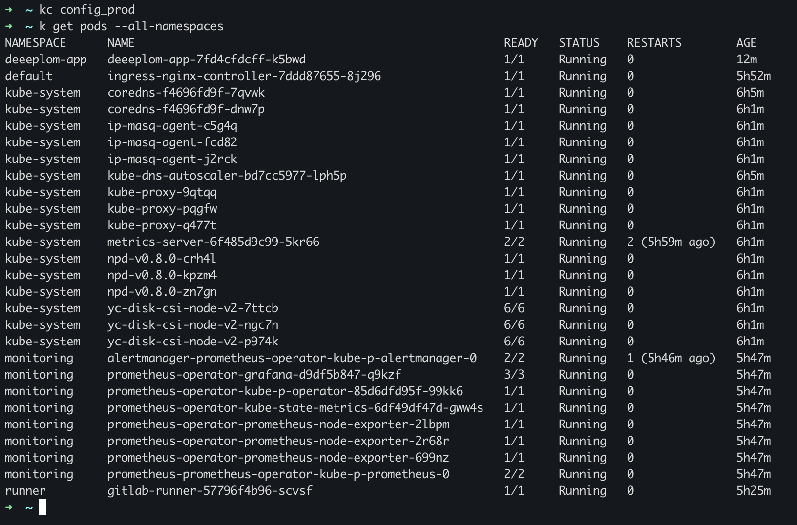 <br>
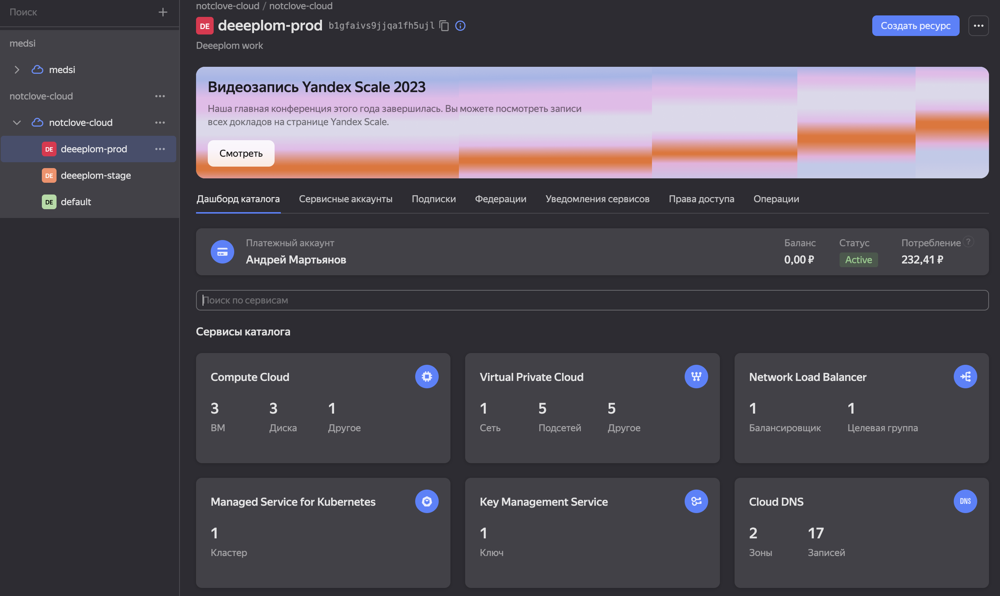 <br>
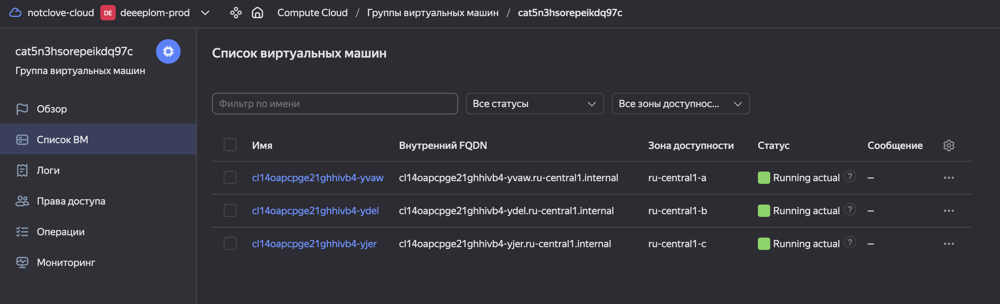 <br>

stage: <br>
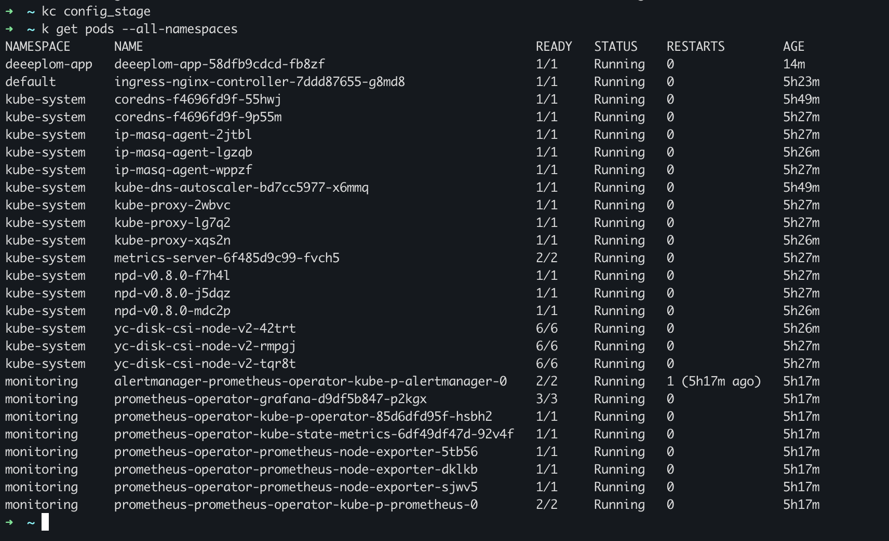 <br>
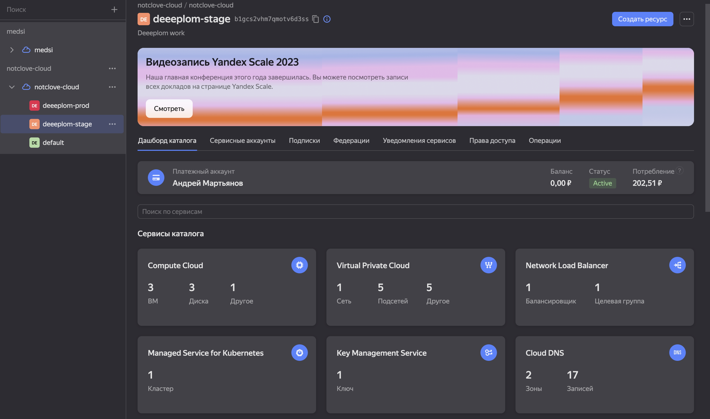 <br>
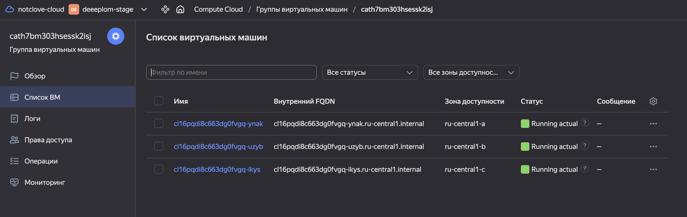 <br>

</details><br>


## Этап 3:

<details>
    <summary><h2>Создание тестового приложения</h1></summary>

Для перехода к следующему этапу необходимо подготовить тестовое приложение, эмулирующее основное приложение разрабатываемое вашей компанией.

Способ подготовки:

1. Рекомендуемый вариант:  
   а. Создайте отдельный git репозиторий с простым nginx конфигом, который будет отдавать статические данные.  
   б. Подготовьте Dockerfile для создания образа приложения.  
2. Альтернативный вариант:  
   а. Используйте любой другой код, главное, чтобы был самостоятельно создан Dockerfile.

Ожидаемый результат:

1. Git репозиторий с тестовым приложением и Dockerfile.
2. Регистр с собранным docker image. В качестве регистра может быть DockerHub или [Yandex Container Registry](https://cloud.yandex.ru/services/container-registry), созданный также с помощью terraform.

---

## Ответ:

Я решил создать gitlab репозиторий на официальном сайте, потому что это бесплатно :) <br>
[https://gitlab.com/Notclove/deeeplom-app](https://gitlab.com/Notclove/deeeplom-app) 

Репозиторий docker образов решил оставить dockerhub <br> 
[prod](https://hub.docker.com/repository/docker/notclove/deeeplom-app-main/general) <br>
[stage](https://hub.docker.com/repository/docker/notclove/deeeplom-app-stage/general)<br> 

</details><br>

## Этап 4:

<details>
    <summary><h2>Подготовка cистемы мониторинга и деплой приложения</h1></summary>

Уже должны быть готовы конфигурации для автоматического создания облачной инфраструктуры и поднятия Kubernetes кластера.  
Теперь необходимо подготовить конфигурационные файлы для настройки нашего Kubernetes кластера.

Цель:
1. Задеплоить в кластер [prometheus](https://prometheus.io/), [grafana](https://grafana.com/), [alertmanager](https://github.com/prometheus/alertmanager), [экспортер](https://github.com/prometheus/node_exporter) основных метрик Kubernetes.
2. Задеплоить тестовое приложение, например, [nginx](https://www.nginx.com/) сервер отдающий статическую страницу.

Рекомендуемый способ выполнения:
1. Воспользовать пакетом [kube-prometheus](https://github.com/prometheus-operator/kube-prometheus), который уже включает в себя [Kubernetes оператор](https://operatorhub.io/) для [grafana](https://grafana.com/), [prometheus](https://prometheus.io/), [alertmanager](https://github.com/prometheus/alertmanager) и [node_exporter](https://github.com/prometheus/node_exporter). При желании можете собрать все эти приложения отдельно.
2. Для организации конфигурации использовать [qbec](https://qbec.io/), основанный на [jsonnet](https://jsonnet.org/). Обратите внимание на имеющиеся функции для интеграции helm конфигов и [helm charts](https://helm.sh/)
3. Если на первом этапе вы не воспользовались [Terraform Cloud](https://app.terraform.io/), то задеплойте в кластер [atlantis](https://www.runatlantis.io/) для отслеживания изменений инфраструктуры.

Альтернативный вариант:
1. Для организации конфигурации можно использовать [helm charts](https://helm.sh/)

Ожидаемый результат:
1. Git репозиторий с конфигурационными файлами для настройки Kubernetes.
2. Http доступ к web интерфейсу grafana.
3. Дашборды в grafana отображающие состояние Kubernetes кластера.
4. Http доступ к тестовому приложению.

---

## Ответ:

1. prometheus & grafana установил через маркетплейс яндекса <br> 
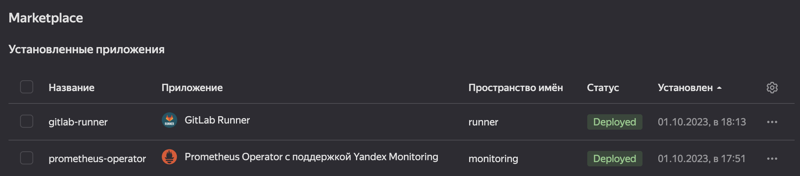
2. И просто добавил ingress: <br>
[prod](./task/k8s/prod-grafana.notclove.ru.yaml) <br>
[stage](./task/k8s/stage-grafana.notclove.ru.yaml)<br>

    [grafana.notclove.ru](https://grafana.notclove.ru/)<br>
    [stage-grafana.notclove.ru](https://stage-grafana.notclove.ru/)<br>
    ```
    login: admin
    passw: prom-operator
    ```
3. prod:<br>
    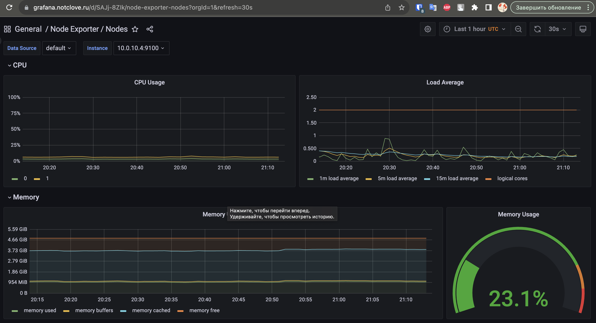 <br>
   stage: <br>
    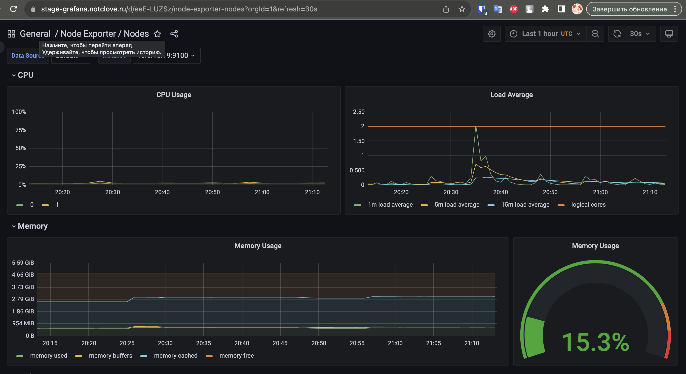<br>
4. Тестовое приложение доступно по ссылкам: <br>
   [https://deep.notclove.ru/](https://deep.notclove.ru/) <br>
   [https://stage-deep.notclove.ru/](https://stage-deep.notclove.ru/) <br>

   Предельно простое, написанное на python'e, использует flask и при переходе на корневой урл, открывается случайную картинку с котиками <br>
   код приложения можно глянуть [тут](https://gitlab.com/Notclove/deeeplom-app/-/blob/stage/app/app/main.py?ref_type=heads)


</details><br>

## Этап 5:

<details>
    <summary><h2>Установка и настройка CI/CD</h1></summary>

Осталось настроить ci/cd систему для автоматической сборки docker image и деплоя приложения при изменении кода.

Цель:

1. Автоматическая сборка docker образа при коммите в репозиторий с тестовым приложением.
2. Автоматический деплой нового docker образа.

Можно использовать [teamcity](https://www.jetbrains.com/ru-ru/teamcity/), [jenkins](https://www.jenkins.io/), [GitLab CI](https://about.gitlab.com/stages-devops-lifecycle/continuous-integration/) или GitHub Actions.

Ожидаемый результат:

1. Интерфейс ci/cd сервиса доступен по http.
2. При любом коммите в репозиторие с тестовым приложением происходит сборка и отправка в регистр Docker образа.
3. При создании тега (например, v1.0.0) происходит сборка и отправка с соответствующим label в регистр, а также деплой соответствующего Docker образа в кластер Kubernetes.

---

## Ответ:

ci/cd организовал через gitlab: [gitlab-ci.yaml](https://gitlab.com/Notclove/deeeplom-app/-/blob/stage/.gitlab-ci.yml?ref_type=heads)

В Репозитории 2 ветки, stage и main, соответственно сборка контейнера и деплой происходит в своих ветках и деплой в прод происходит когда ветка stage мержится в ветку main

Примеры работы:
У каждой ветки свои docker образы:
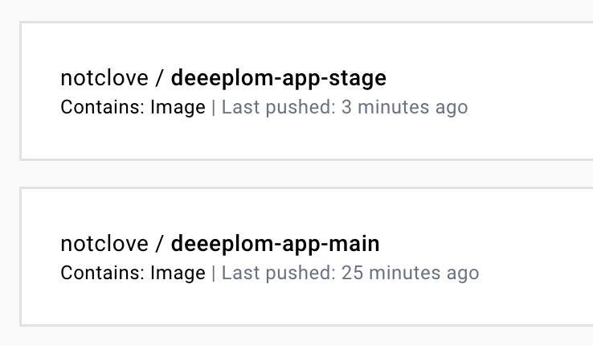 <br>
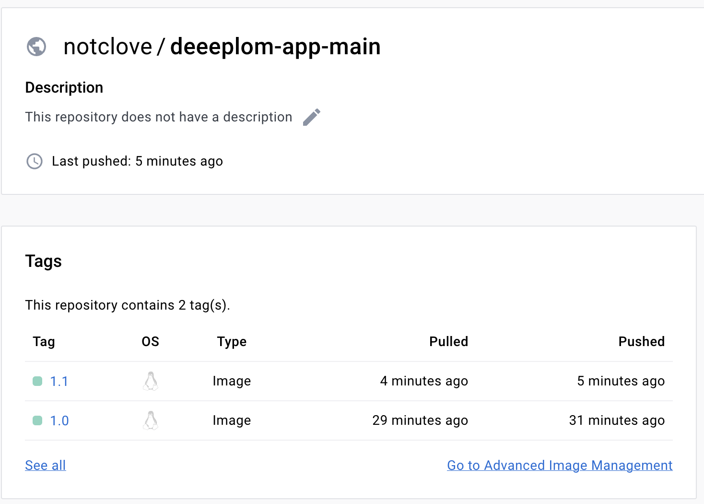 <br>
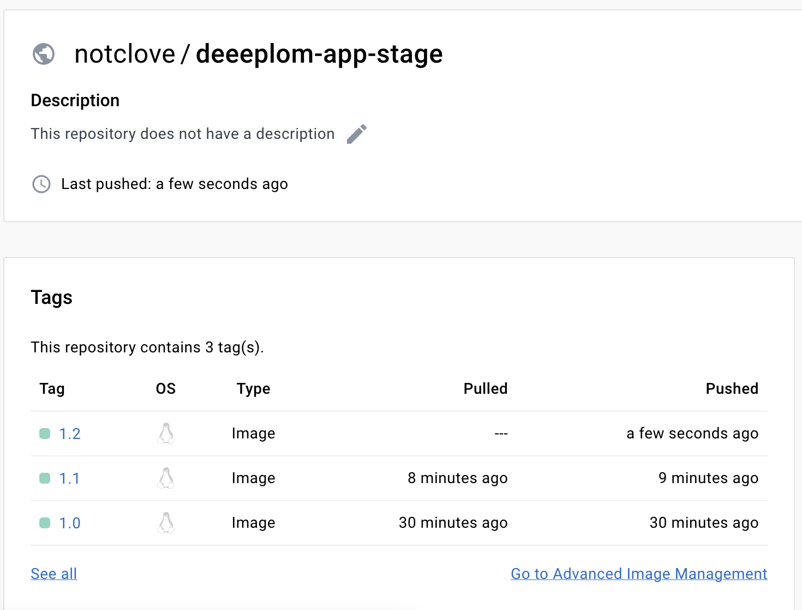 <br>

пайплайны проходят без ошибок:
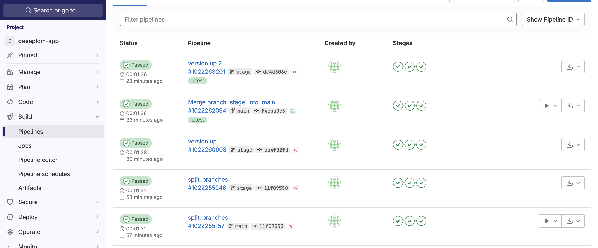 <br>
[lint job](https://gitlab.com/Notclove/deeeplom-app/-/jobs/5200217581) <br>
[build job](https://gitlab.com/Notclove/deeeplom-app/-/jobs/5200217582) <br>
[deploy job](https://gitlab.com/Notclove/deeeplom-app/-/jobs/5200217583) <br>

</details><br>